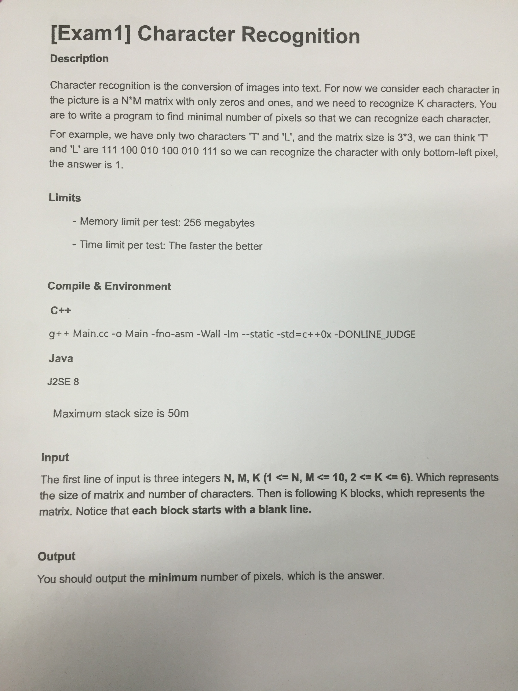
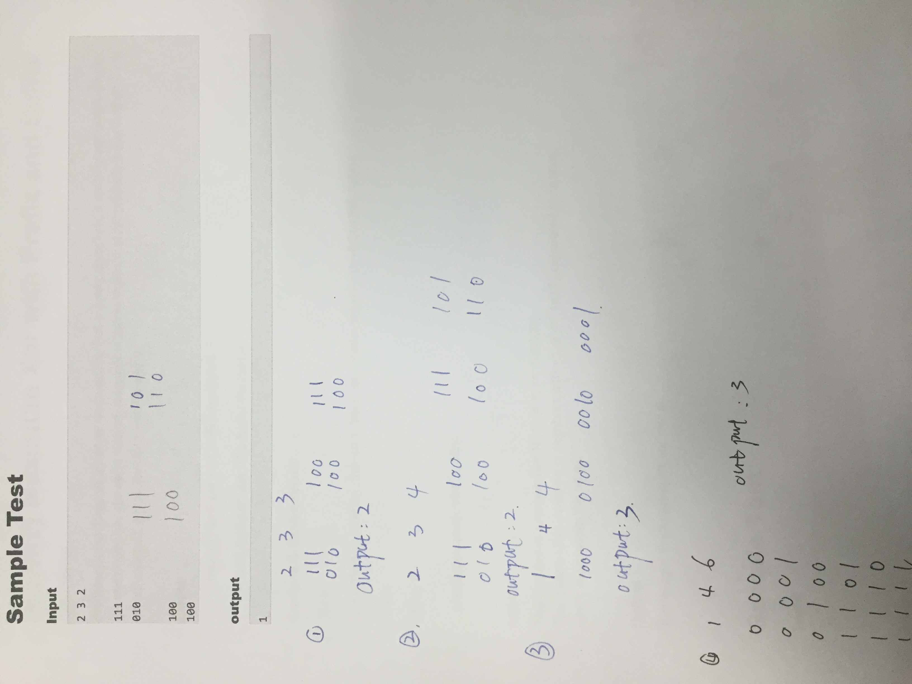
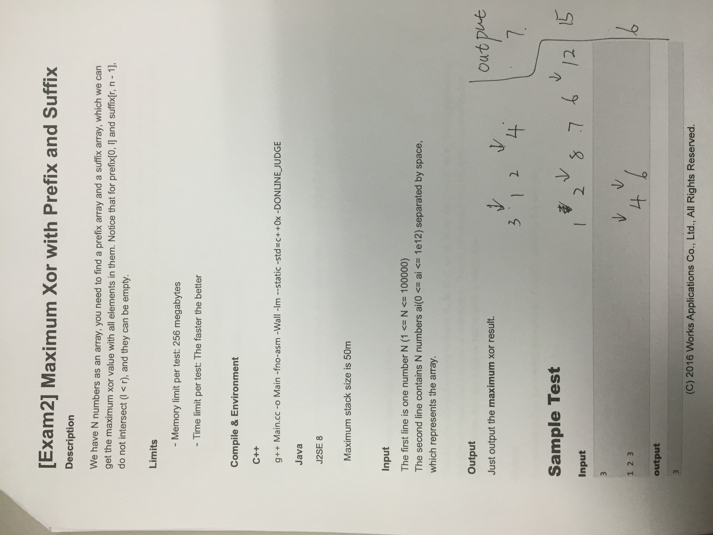
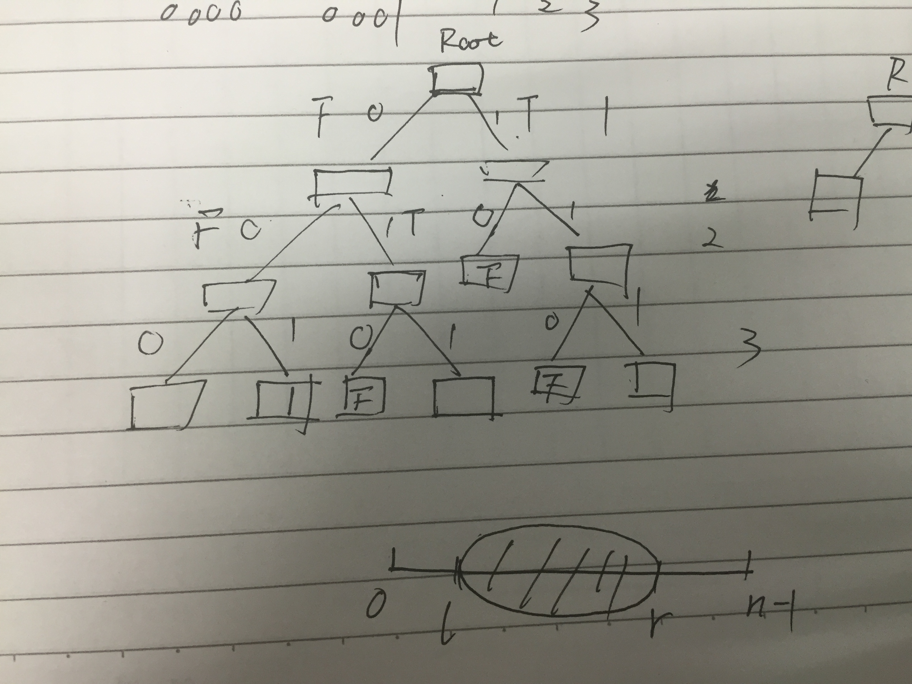

---
layout: post
title: 万始革笔试OJ
date: 2016-05-26 10:51:14
tags: 
category: 
comments: true
---


周一去鼓楼校区听Works Application的宣讲,现场发了两道OJ,看着挺有趣,花了一下午加一晚上才做出来OTZ,第一题尤其麻烦(可能是我的方法有问题),不过第二题给了一些很有趣的启示,于是觉得值得一记.

#### EXAM1

题目如下


<br>


解决方法是找最大划分.这时可能出现一些问题,比如以下例子:

```
1 5 6    
00000    

00010    

01000    

11011    

11110    

11111    
```

解决方法是将"最大划分"改为"较大划分",但这时在矩阵个数较少的时候可能会导致无限循环下去.所以想快排那样对于一个比较小的矩阵集合,选择"最大划分"的策略.

代码等deadline之后再上吧.

[代码在这里]()

#### EXAM2

题目如下



这个很有趣.

因为是要选l和r,可以把问题看做找一个线段[l,r]的问题,先求出所有数的xor,设为xor_sum,因为a\^a=0,而0\^b=b,所以直接把某个数和xor_sum求xor,即得到去掉这个数的xor.目的已知了,求使得xor最大的线段[l,r],接下来就可以解题了.

思路是trie树,参考了[GeeksforGeeks](http://www.geeksforgeeks.org/find-the-maximum-subarray-xor-in-a-given-array/)中的一篇.画了个图如下:



可能是平时对trie树的理解只停留在知道,而没有真正写过,考虑类似问题的时候没能第一下就相对trie. 对比起常规的类似蛮力的O(n^2 )算法,这个trie的复杂度O(n)就显现出了明显的优势.

同样,deadline以后上代码.

[代码在这里]()